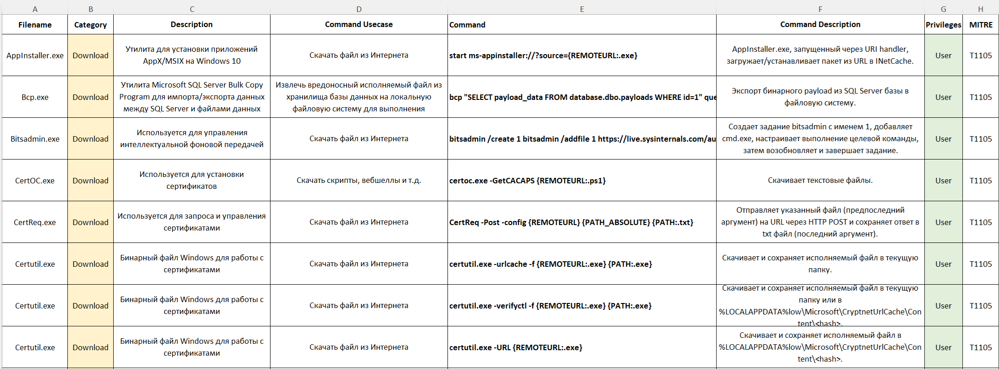

# LOLBAS — Русская адаптация

Русскоязычный справочник по технике «Living off the Land» на основе проекта [LOLBAS](https://github.com/LOLBAS-Project/LOLBAS).  
Актуален на начало 2026 года и включает более **400 техник** с переводом, систематизацией и привязкой к MITRE ATT&CK.

> **Всё в одной таблице** — быстро фильтруй по категории, технике, OS или привилегиям, не переключаясь между источниками.  
> Экономит время при расследовании инцидентов, Threat Hunting и подготовке к тестированию на проникновение.  
> Полезен как для **Blue Team** (SOC, IR, Detection Engineering), так и для **Red Team** (Pentest, оценка защищённости).
> Антивирусное ПО может ошибочно удалять .xlsx файл. Если не доверяете автору — используйте .MD или .JSON версии из соответствующих папок репозитория.

---


## Что такое LOLBAS

**LOLBAS (Living Off the Land Binaries, Scripts and Libraries)** — база знаний о легитимных исполняемых файлах, скриптах и библиотеках Windows, которые злоумышленники могут использовать для вредоносных действий без загрузки стороннего ПО.

Техники «Living off the Land» опасны тем, что:
- используют доверенные, подписанные компоненты ОС;
- сложно детектируются стандартными средствами защиты;
- применяются на всех этапах атаки — от разведки до эксфильтрации.

---

## Зачем нужна эта адаптация

- Полный перевод описаний и сценариев на русский язык.
- Единый справочник в формате `.xlsx` — удобная фильтрация по цветам, категориям, OS и привилегиям.
- Каждая категория вынесена на отдельный лист.
- Общий лист с привязкой к MITRE ATT&CK, поддерживаемой ОС, привилегиями и путями до бинарников.
- Данные также доступны в формате Markdown и JSON.

---

## Структура репозитория

```
LOLBAS_RUSSIAN/
├── LOLBAS-RUSSIAN.xlsx          # Основной справочник (рекомендуется)
├── LOLBAS-RUSSIAN_MD/           # Таблицы в формате Markdown
│   ├── 01_DESC.md               # Описание проекта и категорий
│   ├── 02_1DownloadUpload.md    # Загрузка и выгрузка файлов
│   ├── 03_2Execute.md           # Выполнение кода
│   ├── 04_3Copy.md              # Копирование файлов
│   ├── 05_4ADS.md               # Альтернативные потоки данных NTFS
│   ├── 06_5AWL.md               # Обход белого списка приложений
│   ├── 07_6CompileConceal.md    # Компиляция и сокрытие
│   ├── 08_7UAC_BPSS.md          # Обход UAC
│   ├── 09_8Credentials.md       # Работа с учётными данными
│   ├── 10_9EncodeDecode.md      # Кодирование / декодирование
│   ├── 11_10Dump.md             # Дамп памяти и данных
│   ├── 12_11ReconTamper.md      # Разведка и манипуляция системой
│   ├── 13_ALL.md                # Все техники сводно
│   ├── 14_BINPATHS.md           # Пути до бинарников
│   ├── 15_MITRE OS.md           # Привязка MITRE ATT&CK + ОС
│   ├── 16_DETECTIONS.md         # Методы обнаружения
│   └── 17_Authors.md            # Авторы оригинальных техник
└── LOLBAS-RUSSIAN_JSON/         # Данные в формате JSON
    ├── ALL.json                 # Все техники
    ├── all-categories.json      # Список категорий
    ├── 1DownloadUpload.json
    ├── 2Execute.json
    ├── 3Copy.json
    ├── 4ADS.json
    ├── 5AWL.json
    ├── 6CompileConceal.json
    ├── 7UAC_BPSS.json
    ├── 8Credentials.json
    ├── 9EncodeDecode.json
    ├── 10Dump.json
    ├── 11ReconTamper.json
    ├── BINPATHS.json
    ├── MITRE  OS.json
    ├── DETECTIONS.json
    ├── DESC.json
    └── Authors.json
```

---

## Категории техник

| Категория | Описание |
|-----------|----------|
| **Download** | Загрузка вредоносных payload'ов с удалённых серверов через легитимные утилиты (bitsadmin, certutil, powershell и др.) |
| **Upload** | Эксфильтрация данных с компрометированной машины через системные инструменты (curl, ftp, powershell и др.) |
| **Execute** | Запуск произвольного кода, скриптов или команд через доверенный бинарник-прокси (wscript, rundll32 и др.) |
| **Copy** | Копирование и перемещение файлов системными утилитами в рамках подготовки к атаке или эксфильтрации (xcopy, robocopy и др.) |
| **ADS** | Сокрытие данных в альтернативных потоках NTFS (file.txt:evil.exe) для обхода защиты и ограничений по расширениям |
| **AWL Bypass** | Обход белых списков приложений (AppLocker, WDAC) через доверенные подписанные бинарники (msbuild, regsvr32 и др.) |
| **Compile** | Компиляция вредоносного кода прямо на целевой системе через штатные инструменты разработки (csc.exe, msbuild.exe) |
| **Conceal** | Маскировка вредоносной активности через атрибуты файлов, реестр, ADS и другие возможности ОС |
| **UAC Bypass** | Повышение привилегий без UAC-запроса через уязвимости доверенных компонентов Windows (fodhelper, sdclt, eventvwr и др.) |
| **Credentials** | Кража и дамп учётных данных, хешей, Kerberos-билетов через системные инструменты (reg.exe, rundll32/DPAPI и др.) |
| **Encode** | Кодирование данных и бинарников (Base64 и др.) для сокрытия при передаче или выполнении в памяти |
| **Decode** | Декодирование закодированных файлов обратно в исполняемый формат (certutil -decode и др.) |
| **Dump** | Извлечение конфиденциальных данных из памяти процессов (LSASS и др.), файлов или реестра |
| **Reconnaissance** | Сбор информации о системе, сети, пользователях и конфигурациях (whoami, systeminfo, nltest, net и др.) |
| **Tamper** | Изменение конфигурации системы, реестра, служб или журналов для отключения защиты и обеспечения персистентности |

---

## Описание колонок справочника

| Колонка | Описание |
|---------|----------|
| **Filename** | Имя исполняемого файла (например, `eventvwr.exe`) — для поиска в логах и на диске |
| **Command Category** | Тактическая категория злоупотребления (UAC Bypass, Upload и др.) |
| **Description** | Легитимное назначение утилиты в ОС |
| **Command Usecase** | Конкретный вредоносный сценарий (например, «Выполнение кода с повышенными правами») |
| **Command** | Точная командная строка — практическая инструкция реализации техники |
| **Command Description** | Разъяснение механики: как команда достигает вредоносной цели |
| **Command Privileges** | Требуемые права: `User` или `Admin` |
| **MITRE ATT&CK technique** | Идентификатор техники (например, `T1548.002`) |
| **Operating System** | Поддерживаемые версии Windows |
| **Paths** | Ожидаемые пути к файлу — для валидации легитимности расположения процесса |
| **Tags** | Дополнительные теги фильтрации (например, `Execute:CMD`, `Application:GUI`) |
| **Date** | Дата добавления/обновления техники |

---

## Применение

Справочник предназначен для работы специалистов по ИБ:

- **Blue Team / SOC / IR** — быстрая проверка подозрительных команд и процессов в инцидентах
- **Threat Hunting** — поиск аномалий по известным техникам LotL
- **Detection Engineering** — создание правил обнаружения (SIEM, EDR) на основе техник и командных строк
- **Penetration Testing** — оценка защищённости в рамках согласованных с заказчиком работ
- **Обучение** — формирование осведомлённости о технике LotL

---

## Checksums **LOLBAS-RUSSIAN.xlsx**
MD5:
6f53849910d11275ced089a28e5b7f1b

SHA1:
b06162aa868b1f09dff525231953c6949585fd50

SHA256:
d4521fa426a9dcb1ec97d1b733958bb581166f1da4b20b6ae1f01497e0fac7d7


## Оригинальный проект

- GitHub: [LOLBAS-Project/LOLBAS](https://github.com/LOLBAS-Project/LOLBAS)
- Сайт: [lolbas-project.github.io](https://lolbas-project.github.io)

Выражаем огромное уважение авторам и контрибьюторам оригинального проекта LOLBAS, чей труд лёг в основу этого справочника. Благодарим всё сообщество специалистов, которые документировали и исследовали описанные техники.

---

## Отказ от ответственности

Информация в этом справочнике предназначена **исключительно для легитимных целей** в сфере информационной безопасности.  
Автор **не несёт ответственности** за любое нелегитимное, противозаконное или вредоносное использование представленных материалов.  
Используйте эти знания ответственно, в рамках этического кодекса и действующего законодательства.
